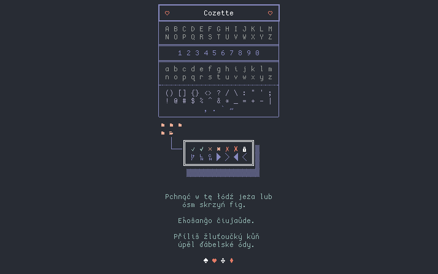
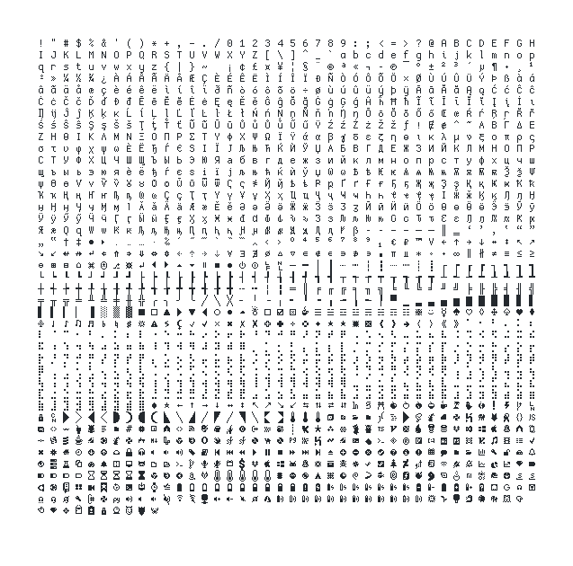
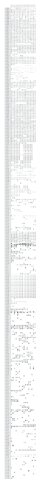

# Cozette

[](https://github.com/slavfox/Cozette/releases/latest)
[](https://aur.archlinux.org/packages/cozette-otb/)


[](https://github.com/slavfox/Cozette/blob/master/LICENSE)



A bitmap programming font optimized for coziness.

# Contents

- [About Cozette](#about-cozette)
- [Installation](#installation)
  - [Linux](#linux)
  - [Mac](#mac)
  - [Windows](#windows)
- [Roadmap](#roadmap)
- [Character map](#character-map)
- [License](#license)

# About Cozette

Cozette is based on [Dina], which itself is based on [Proggy].
It's also heavily inspired by [Creep]. I absolutely adore Creep, and was
using it up until I got a higher-DPI screen for which it was slightly too
small. That prompted me to make the bitmap font I always wished existed: 
Cozette; a small-but-not-tiny bitmap font with great coverage of all the 
glyphs *you* might encounter in the terminal:



I'm intentionally putting the emphasis on "you" - although Cozette already
has all the glyphs I've seen in my CLI tools so far, *you* might find it's
missing a glyph you wish it had. If that's the case, *please [file an issue]*!
It's an important goal for Cozette to be a useful bitmap alternative to
[Nerd Fonts].

A nicer character map that includes the codepoints can be found at 
[the bottom of this README]!

# Installation

### [You can get Cozette over at the Releases tab]!

Cozette is distributed in two main variants: bitmap and vector.

Bitmap fonts are, effectively, just that - bitmaps. They scale terribly, but
look nice and sharp (and pixel-perfect) if you use them at their intended point
size. Vector fonts scale well, but in this case, might look ugly at
smaller point sizes because of antialiasing issues and the like.

VSCode and a lot of other GUI applications don't support bitmap fonts, so you 
will want to use CozetteVector there. In applications that do support bitmap
fonts, you will want to use the normal, bitmap Cozette (unless it's too
small for you, in which case, CozetteVector scales better).  

### Linux
The preferred format is `.otb` (for bitmaps) or `.ttf` 
(for CozetteVector). To install the font, just throw it in your fonts directory
(you probably want to follow your distro's instructions). On Ubuntu, if you 
don't want to reconsider your distro choice, you might need to
[specifically enable bitmap fonts].

**If you're on Arch**, [ifreund] made [an AUR package] for the .otb! Install it
using your AUR helper of choice:
```
$ yay -S cozette-otb
```
Or, if you're not using an AUR helper:
```
$ git clone https://aur.archlinux.org/cozette-otb.git
$ cd cozette-otb
$ makepkg -si
```

### Mac
Download the `.dfont` and install it with `Font Book .app`.  Both the bitmap
`Cozette.dfont` and the vector `CozetteVector.dfont` should work.

### Windows
Grab `CozetteVector.ttf`. If you want to get the bitmap versions to work, 
[follow the instructions from here].

### BSD / Solaris / Haku /Other

You know what you're doing.

# Roadmap

Check the [CHANGELOG] for the latest news!

Here's where Cozette is so far, in the rough order the features are going to be
implemented:

- [x] ASCII
- [x] Powerline
- [x] Build scripts to handle exporting
- [x] Box-drawing (mostly)
- [x] Braille
- [x] Cyrillic!
- [ ] Nerdfonts:
  - [x] nf-seti-*
  - [ ] nf-dev-* (partial)
  - [ ] nf-weather-*
- [x] Glyph map generation (so I don't have to keep `characters.png` up to
  date)
- [x] "True" TTF version
  - [x] Windows support
- [x] Full [vim-airline] support!
- [x] Full [ranger_devicons] support!
- [x] [starship] supported out of the box!
- [x] Full [powerlevel10k] support! (if it doesn't work, try setting
 `POWERLEVEL9K_MODE` to `nerdfont-complete`)
- [x] Charmap including the code points (to make it easier for users to
      report issues/request additions)
- [ ] Bold version
- [ ] Italic version
- [ ] Ligatures

# Character map

For easy copy-pasting, the character map is provided in text form in 
[img/charmap.txt](./img/charmap.txt). If you just want to see how the glyphs
look in Cozette, here is a screenshot of it:



# Building

If you want to build Cozette yourself, you'll need [FontForge]. Once you
have that, just clone this repo, open `Cozette/Cozette.sfd` in FontForge,
and go to *File → Generate Fonts...*.

To run the build scripts I use to prepare releases, first install Python 3.8
and [pipenv]. Then, install the dependencies and run `build.py fonts`:

```console
$ pipenv install
$ pipenv run python3.8 build.py fonts
```

# License

Cozette is licensed [MIT] 💜


[Dina]: https://www.dcmembers.com/jibsen/download/61/
[Proggy]: https://github.com/bluescan/proggyfonts
[Creep]: https://github.com/romeovs/creep
[great coverage of all the glyphs I might encounter in the terminal]:
    #character-map
[file an issue]: https://github.com/slavfox/Cozette/issues/new
[Nerd Fonts]: https://www.nerdfonts.com/
[the bottom of this README]: #character-map
[You can get Cozette over at the Releases tab]:
    https://github.com/slavfox/Cozette/releases
[ifreund]: https://github.com/ifreund
[an AUR package]: https://aur.archlinux.org/packages/cozette-otb/
[specifically enable bitmap fonts]:
    https://bugs.launchpad.net/ubuntu/+source/fontconfig/+bug/1560114
[follow the instructions from here]: 
    https://wiki.archlinux.org/index.php/installation_guide
[CHANGELOG]: ./CHANGELOG.md
[vim-airline]: https://github.com/vim-airline/vim-airline/
[ranger_devicons]: https://github.com/alexanderjeurissen/ranger_devicons
[starship]: https://starship.rs/
[fontforge]: https://fontforge.org/en-US/
[powerlevel10k]: https://github.com/romkatv/powerlevel10k/
[pipenv]: https://github.com/pypa/pipenv
[MIT]: ./LICENSE
