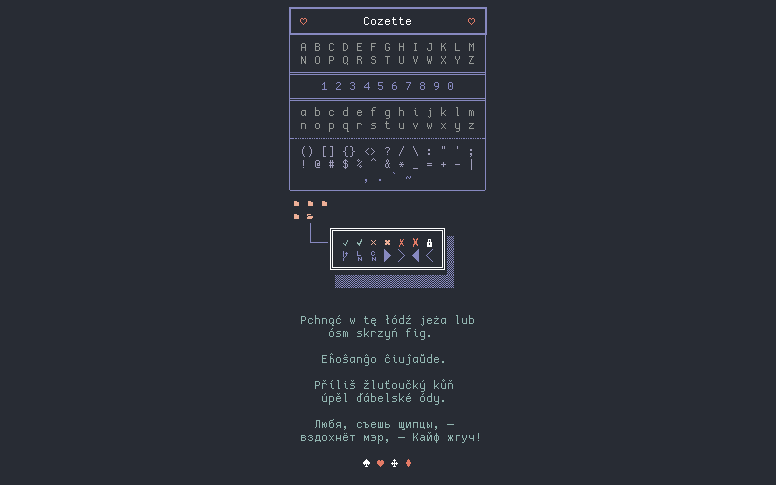
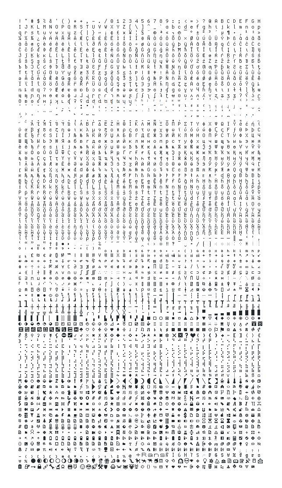
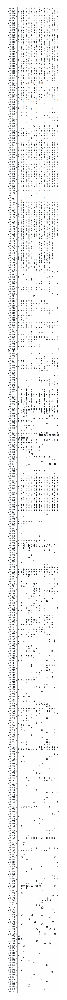

# Cozette

[](https://github.com/slavfox/Cozette/releases/latest)
[](https://aur.archlinux.org/packages/cozette-otb/)


[](https://github.com/slavfox/Cozette/blob/master/LICENSE)



A bitmap programming font optimized for coziness.


# Contents

- [About Cozette](#about-cozette)
- [Installation](#installation)
  - [Linux](#linux)
  - [Mac](#mac)
  - [Windows](#windows)
  - [Notes on specific applications](#notes-on-specific-applications)
    - [Dmenu](#dmenu)
    - [VSCode, general GUI applications](#vscode-general-gui-applications)
    - [Kitty](#kitty)
  - [Variants](#variants)
- [Roadmap](#roadmap)
- [Recommended alternatives](#recommended-alternatives)
- [Character map](#character-map)
- [Building](#building)
- [Contributors](#contributors)
- [License](#license--acknowledgements)

# About Cozette

Cozette is a 6x13px (bounding box; average 5px character width, 3px
descent, 10px ascent, 8px cap height) bitmap font based on [Dina], which
itself is based on [Proggy].
It's also heavily inspired by [Creep]. I absolutely adore Creep, and was
using it up until I got a higher-DPI screen for which it was slightly too
small. That prompted me to make the bitmap font I always wished existed:
Cozette; a small-but-not-tiny bitmap font with great coverage of all the
glyphs _you_ might encounter in the terminal:



I'm intentionally putting the emphasis on "you" - although Cozette already
has all the glyphs I've seen in my CLI tools so far, _you_ might find it's
missing a glyph you wish it had. If that's the case, _please [file an issue]_!
It's an important goal for Cozette to be a useful bitmap alternative to
[Nerd Fonts].

A nicer character map that includes the codepoints can be found at
[the bottom of this README]!

# Installation

### [You can get Cozette over at the Releases tab]!

## Variants and Sizes

Cozette is distributed in three main variants: normal and hi-dpi (upscaled 2x) bitmaps 
(`.bdf`, `.otb`, `.psf`, and `.fnt`), and vectors (`.ttf`).

Font scaling varies wildly from system to system, and sometimes even from
program to program and font format to format. On my system (Linux), `cozette.otb`
looks right at 13pts; `cozette_hidpi.otb` looks right at 26pts and downscales 
quite elegantly to 10pts; `CozetteVector` doesn't look right at any size (technically,
it will look right specifically at 9.4pts on a 100dpi screen on Linux, but pixel-perfect
bitmap fonts are a massive headache, treated differently by every OS, that I'm not quite sure how to solve)

Bitmap fonts are, effectively, just that - bitmaps. They scale terribly, but
look nice and sharp (and pixel-perfect) at one specific point
size. Vector fonts scale well, but in this case, might look ugly at
smaller point sizes because of antialiasing issues and the like.

<h3>NOTE:</h3>
The vector formats (`CozetteVector`) are provided as a compatibility feature.
Rendering of vectorized bitmap-like fonts is <em>terrible</em> on virtually all operating systems.
  
If Cozette looks awful on your system, you probably have a vector version.
<em>Please</em> use the bitmap formats (`.otb`) if you can.

Issues with vector formats will almost certainly <em>not</em> be fixed or 
addressed; Cozette is a bitmap font first and foremost, and building a
bitmap font that builds from a single source and looks good both in its intended,
bitmap font as well as as the auto-vectorized format, on every OS, seems to be an unsolved problem. 

### Linux

The preferred format is `.otb` (for bitmaps) or `.ttf`
(for CozetteVector). To install the font, just throw it in your fonts directory
(you probably want to follow your distro's instructions). On Ubuntu you might need to
[specifically enable bitmap fonts].

**If you're on Void**, [ifreund] made [a Void package](https://github.com/void-linux/void-packages/tree/master/srcpkgs/font-cozette) for the .otb! Install it
using XBPS:

```
$ sudo xbps-install font-cozette
```

**If you're on Arch**, [ifreund] made [an AUR package] for the .otb! Install it
using your AUR helper of choice:

```
$ yay -S cozette-otb
```

Or, if you're not using an AUR helper:

```
$ git clone https://aur.archlinux.org/cozette-otb.git
$ cd cozette-otb
$ makepkg -si
```

### Mac

Download the `.dfont` and install it with `Font Book .app`. Both the bitmap
`Cozette.dfont` and the vector `CozetteVector.dfont` should work.

### Windows

Grab `CozetteVector.ttf`. If you want to get the bitmap versions to work,
[follow the instructions from here].

### FreeBSD

[laxul] made a [port] for the `.otb`!

* pkg: `pkg install cozette`
* ports: `cd /usr/ports/x11-fonts/cozette; make install clean`

### Other BSD / Solaris / Haiku / Other

You know what you're doing.

### Notes on specific applications

#### Dmenu

`dmenu` (and reportedly some other applications, like `urxvt`) seems slightly
fucky when it comes to dealing with font spacing. I cannot tell if this is an
issue with Cozette specifically or with the font rendering in those
applications, but they seem to pull the font spacing from your system's default
monospace font for whatever reason. If setting Cozette as your system default
is not an option (I don't recommend it, a lot of applications have problems
with bitmap fonts), try using `Cozette-<size>` as the font name, ie.
`Cozette-8`.

#### VSCode, general GUI applications

VSCode and a lot of other GUI applications don't support bitmap fonts, so you
will want to use CozetteVector there. In applications that do support bitmap
fonts, you will want to use the normal, bitmap Cozette (unless it's too
small for you, in which case, CozetteVector scales better).

#### VSCode Letter Spacing

Sometimes the font might render without proper space betweening the characters (font size set to 13):


To fix this you need to set (in your settings):
- terminal.integrated.letterSpacing to 1


After that your terminal should look like this (font size set to 13):


_Note: VSCode also provides the option editor.letterSpacing which adjusts the spacing for the file editor._

#### Kitty

**[4e554c4c](https://github.com/4e554c4c) made [an AUR package for `kitty` patched to support bitmap fonts](https://aur.archlinux.org/packages/kitty-bitmap/).**

> `if you like bitmap fonts, kitty is not for you.`

**According to its author, `kitty` [doesn't, and never will, support bitmap fonts](https://github.com/kovidgoyal/kitty/issues/97#issuecomment-373970232)**.

If you _really_ want to get Cozette working, you can try the [AUR package mentioned above](https://aur.archlinux.org/packages/kitty-bitmap/), or apply [the patch there](https://aur.archlinux.org/cgit/aur.git/tree/Allow-bitmap-fonts.patch?h=kitty-bitmap) yourself.

If that doesn't work, you can try the trick from [here](https://github.com/kovidgoyal/kitty/issues/97#issuecomment-579094656); if you
explicitly set Cozette(Vector)'s `spacing` to 100, and `scalable` to `true` in `fontconfig`, `kitty` _should_ accept it.

You can also make Cozette work flawlessly by uninstalling `kitty` and using a terminal emulator for which _not rendering fonts_ isn't a design principle - I cannot recommend [alacritty](https://github.com/alacritty/alacritty/) enough. it's excellent, has worked flawlessly for me for quite some time, and both configuring and getting bitmap fonts to work in it is a breeze.

(The support was discussed in [slavfox/Cozette#18](https://github.com/slavfox/Cozette/issues/18). Many thanks to all the participants there, especially to to Luflosi, who brought up flipping the `allow_bitmapped_fonts` flag in [their fork](https://github.com/Luflosi/kitty/commit/e645e0b5ed084c2c57ecfb8acafc07e76f5717bb), and to [4e554c4c](https://github.com/4e554c4c), who made the AUR package.)

# Roadmap

Check the [CHANGELOG] for the latest news!

Here's where Cozette is so far, in the rough order the features are going to be
implemented:

- [x] ASCII
- [x] Powerline
- [x] Build scripts to handle exporting
- [x] Box-drawing (mostly)
- [x] Braille
- [x] Cyrillic!
- [x] IPA glyphs!
- [x] APL glyphs (based on the list from [APL386](https://abrudz.github.io/APL386/))!
- [x] [Uiua](https://www.uiua.org/) glyphs!
- [x] [BQN](https://mlochbaum.github.io/BQN/fonts.html) glyphs!
- [x] Fullwidth kana!
- [ ] Nerdfonts:
  - [x] nf-pom-\*
  - [x] nf-seti-\*
  - [ ] nf-dev-\* (partial)
  - [ ] nf-weather-\*
- [x] Glyph map generation (so I don't have to keep `characters.png` up to
      date)
- [x] "True" TTF version
  - [x] Windows support
- [x] Full [vim-airline] and [bufferline.nvim] support!
- [x] Full [ranger_devicons] support!
- [x] [starship] supported out of the box!
- [x] Full [powerlevel10k] support! (if it doesn't work, try setting
      `POWERLEVEL9K_MODE` to `nerdfont-complete`)
- [x] All glyphs used by [maturin](https://github.com/PyO3/maturin) and many other CLI tools!
- [x] Charmap including the code points (to make it easier for users to
      report issues/request additions)
- [x] Codepoints above U+FFFF in vector fonts
- [x] Upscaled hi-dpi variant
- [x] Crossed seven variant!
  

# Recommended alternatives

Cozette is, intentionally, a very small font. If neither the base nor the 
[HiDpi](#variants) version fit your needs, you might want to look at some
other bitmap fonts with extra glyphs. A couple of my favorites are
[Tamzen](https://github.com/sunaku/tamzen-font/)
and [Envypn](https://github.com/Sorixelle/envypn-powerline). You might also
find the [Tecate/bitmap-fonts repo](https://github.com/Tecate/bitmap-fonts)
useful.

# Character map

For easy copy-pasting, the character map is provided in text form in
[img/charmap.txt](./img/charmap.txt). If you just want to see how the glyphs
look in Cozette, here is a screenshot of it:



# Building

If you want to build Cozette yourself, you'll need [FontForge] and Java. Once you
have that, just clone this repo, open `Cozette/Cozette.sfd` in FontForge,
and go to _File → Generate Fonts..._.

To run the build scripts I use to prepare releases, first install Python (at least 3.8)
and [pipenv]. For generating the images, you will also need `xorg-mkfontscale`
and `xterm`.
Then, install the dependencies and run `build.py fonts`:

```console
$ pipenv install
$ pipenv run python build.py fonts
```

Then install the generated fonts, and run

```console
$ pipenv run python build.py images
```

Running

```console
$ pipenv run python build.py changelog
```

will output the changelog between your local version and the last tag.

# Contributors

Massive thanks to [ym1234] for helping me figure out how to make the font tables behave nicely.

Cozette includes contributions from:

- [autumn]
- [cpkio]
- [dariof4]
- [klinegareth]
- [sungodmoth]
- [yoshiyoshyosh]
- [bluetoad07]
- [PhMajerus]
- [theridane]
- [supersurviveur]
- [breitnw]
- [estradiol enantate]

# License & Acknowledgements

Cozette is licensed [MIT] 💜

Cozette's builds use [bdfscale](https://github.com/philj56/bdfscale) by [philj56](https://github.com/philj56), [Bits'N'Picas](https://github.com/kreativekorp/bitsnpicas) by [Kreative Software](https://github.com/kreativekorp).

[dina]: https://www.dcmembers.com/jibsen/download/61/
[proggy]: https://github.com/bluescan/proggyfonts
[creep]: https://github.com/romeovs/creep
[great coverage of all the glyphs i might encounter in the terminal]: #character-map
[file an issue]: https://github.com/slavfox/Cozette/issues/new
[nerd fonts]: https://www.nerdfonts.com/
[the bottom of this readme]: #character-map
[you can get cozette over at the releases tab]: https://github.com/slavfox/Cozette/releases
[ifreund]: https://github.com/ifreund
[an aur package]: https://aur.archlinux.org/packages/cozette-otb/
[specifically enable bitmap fonts]: https://bugs.launchpad.net/ubuntu/+source/fontconfig/+bug/1560114
[follow the instructions from here]: https://wiki.archlinux.org/index.php/installation_guide
[changelog]: ./CHANGELOG.md
[vim-airline]: https://github.com/vim-airline/vim-airline/
[ranger_devicons]: https://github.com/alexanderjeurissen/ranger_devicons
[starship]: https://starship.rs/
[fontforge]: https://fontforge.org/en-US/
[powerlevel10k]: https://github.com/romkatv/powerlevel10k/
[pipenv]: https://github.com/pypa/pipenv
[mit]: ./LICENSE
[ym1234]: https://github.com/ym1234
[autumn]: https://github.com/auctumnus
[cpkio]: https://github.com/cpkio
[yoshiyoshyosh]: https://github.com/yoshiyoshyosh
[klinegareth]: https://github.com/klinegareth
[dariof4]: https://github.com/dariof4
[laxul]: https://github.com/laxul
[sungodmoth]: https://github.com/sungodmoth
[bluetoad07]: https://github.com/bluetoad07
[PhMajerus]: https://github.com/PhMajerus
[theridane]: https://github.com/theridane
[supersurviveur]: https://github.com/supersurviveur
[breitnw]: https://github.com/breitnw
[estradiol enantate]: https://en.wikipedia.org/wiki/Estradiol_enantate
[port]: https://cgit.freebsd.org/ports/tree/x11-fonts/cozette
[bufferline.nvim]: https://github.com/akinsho/bufferline.nvim
[tmux]: 
